# Introducción

## Modelo OSI

***El Modelo OSI*** (Open Systems Interconnection, o Interconexión de Sistemas Abiertos en español) es como un manual de instrucciones universal que describe cómo los dispositivos de una red se comunican entre sí.

### Funcionalidades por Capa del modelo OSI

- *Capas de Host* (Host Layer): proveen el envío de datos de forma confiable.
    - **Aplicación**: servicios de red a los usuarios y a procesos, aplicaciones.
    - **Presentación/Representación**: formato de los datos.
    - **Sesión:** mantener track de sesiones de la aplicación
    - **Transporte:** establecer y mantener canal “seguro” end-to-end (applic-to-applic).
- *Capas de Medio* (Media Layer): controlan el envío físico de mensajes sobre la red.
    - **Red:** direccionar y rutear los mensajes host-to-host. Comunicar varias redes.
    - **Enlace de datos:** comunicación entre entes directamente conectados. Comunicar una misma red. Acceso al Medio
    - **Física:** transporta la información como señal por el medio físico. Características físicas. Información binaria, digital.

### Ejemplos de Implementaciones por Capa

- **Capa de Aplicación:** Telnet, HTTP, DNS, FTP, DNS, NCP, NDS, X.400.
- **Capa de Presentación / Representación:** PostScript, JPEG, PNG, TIFF, MPEG, ZIP, XDR, ASN, HTML, CharSets(ASCII, ISO-8859-1, UTF-8, EBDIC).
- **Capa de Sesión:**
- **Capa de Transporte:** TCP, UDP, SPX, ISO-TP.
- **Capa de Red:** IP, ICMP, OSPF, IPX, CLNP, IS-IS
- **Capa de Enlace de Datos:** Ethernet, 802.3, 802.11, PPP, HDLC.
- **Capa Física:** RJ-45, EIA/TIA-568C, V.24, V.35, G.703(TEL), G.652(FO) RS-232, DOCSIS(Coax).
    
    
    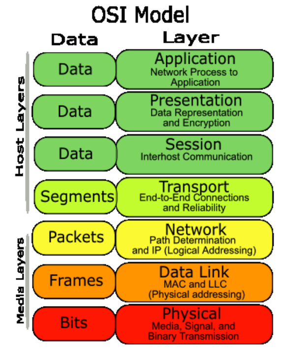
    

## Modelo TCP / IP

Modelo que se convirtió en estándar. Consta de 5 capas, ***Aplicación, Transporte*** o Host-to-Host***, Internet*** o Internetworking***, Enlace*** (Link Layer)***, Física.*** Por simplicidad algunos autores hablan de 4 capas agrupando a la capa de Enlace y la Física en una sola que la llaman Capa de ***Acceso a la Red***.

### Ejemplos de Implementaciones por Capa

- **Capa de aplicación:** Ambos modelos comparten protocolos como HTTP, SMTP y FTP. Sin embargo, el modelo OSI puede incluir protocolos más específicos en cada subcapa.
- **Capa de transporte:** TCP y UDP son comunes a ambos modelos, pero el modelo OSI puede tener protocolos adicionales para la gestión de sesiones.
- **Capa de red:** IP es el protocolo principal en ambos modelos, pero el modelo OSI puede incluir protocolos de enrutamiento más detallados.
- **Capas inferiores:** El modelo TCP/IP combina las capas de enlace de datos y física del modelo OSI en una sola capa, lo que simplifica su implementación.

    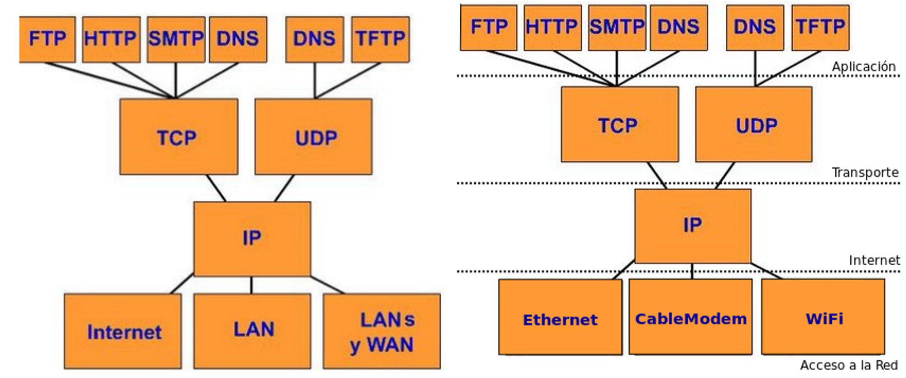
    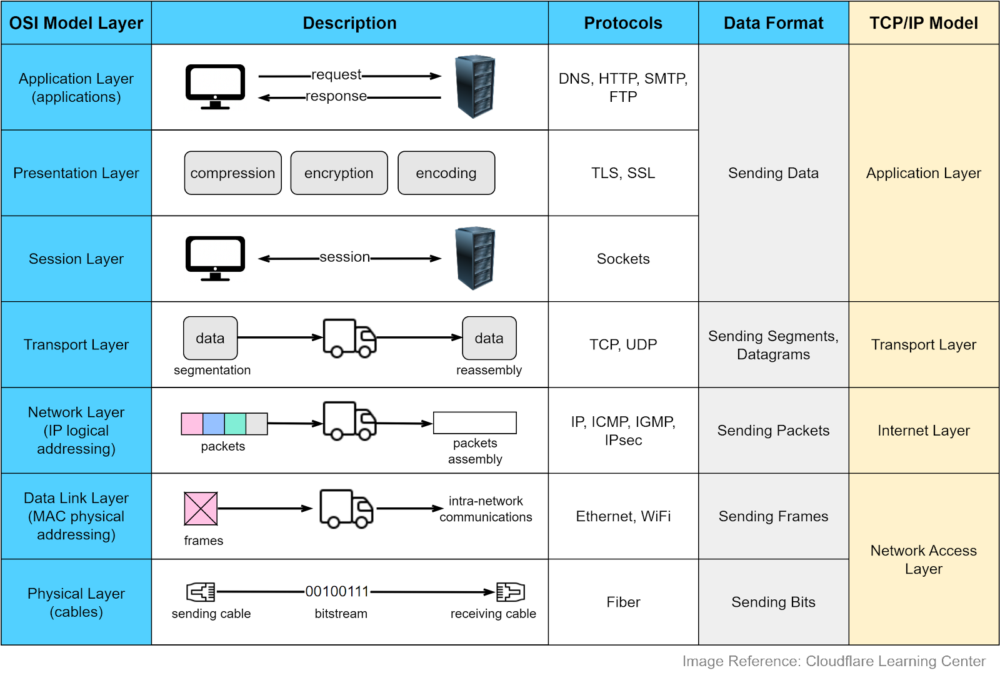

## PDU (Protocol Data Unit)

Cuando se habla de PDU se hace referencia al paquete de datos que se encapsula  y desencapsula a medida que viaje a través de las diferentes capas de la red. Cada capa agrega su propia información de encabezado a los datos.

**Cada capa define su PDU para poder obtener:**

- Encapsulamiento: cada capa toma la PDU de la capa superior, la encapsula en su propia estructura, y le añade la información necesaria para su funcionamiento. Por ejemplo la capa de transporte (TCP/UDP) añade información sobre el puerto de destino para identificar el servicio.
- Funciones específicas: cada capa tiene un rol específico en la comunicación. La PDU de cada capa contiene los campos necesarios para realizar las tareas de esa capa. Por ejemplo:
    - Capa de transporte: Se divide el mensaje en segmentos y se añade información de control de flujo y errores.
    - Capa de red: Cada segmento se encapsula en un paquete y se le asigna una dirección IP.
    - Capa de enlace de datos: El paquete se encapsula en una trama y se añade información de control de acceso al medio.
- Identificación: Las PDUs permiten a los dispositivos de red identificar a que capa pertenecen los datos y cómo deben procesarlos.

    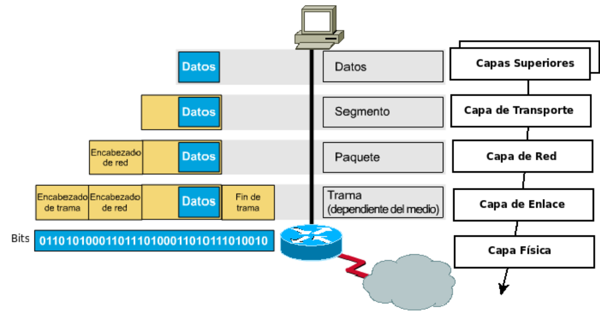
    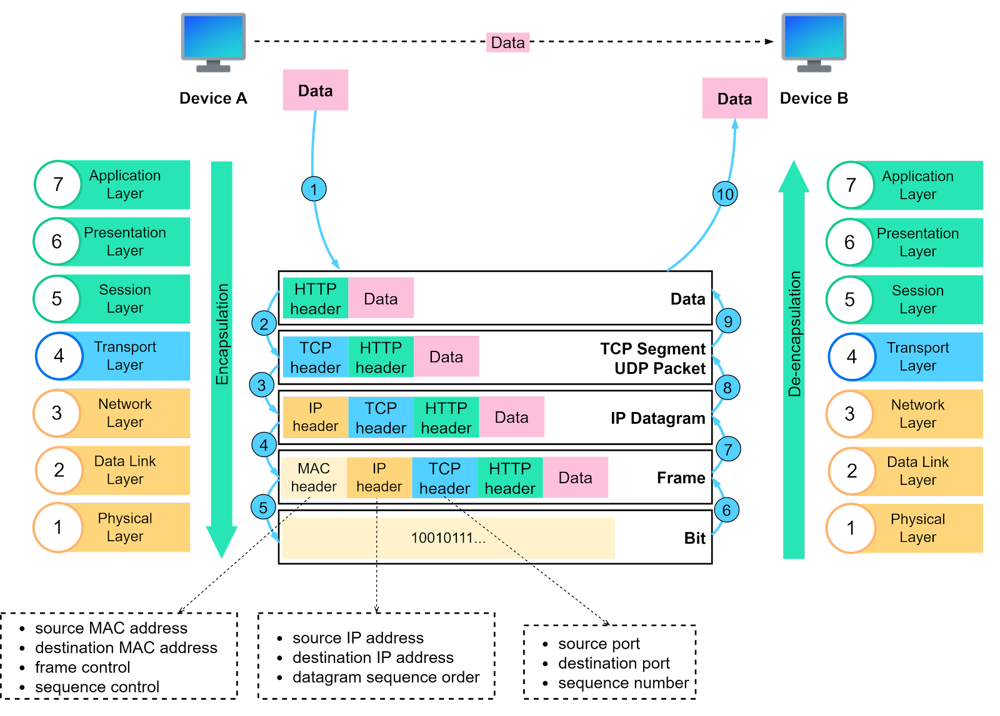

## Comunicación entre capas

- Cada capara usa el servicio de la de abajo.
- Cada capa se comunica con la capa del otro extremo.
- La comunicación es peer-peer


## Clasificación de Redes

Las redes se pueden clasificar de acuerdo a diferentes aspectos:

Clasificación por ***cobertura***

- LAN: (Local Área Network). conectan dispositivos en un área geográfica limitada,  red de cobertura local. Utiliza tecnologías como Ethernet o Wi-Fi.
- MAN: (Metropolitan Área Network). red de cobertura metropolitana, dentro de una ciudad. MetroEthernet, MPLS, Wi-Max.
- WAN: (Wide Área Network). red de cobertura de área amplia. Geográficamente distribuida, conecta países o contienentes. PPP, Frame-Relay, MPLS, HDLC, SONET/SDH.
- SAN: (Storage Área Network). red de almacenamiento. iSCSI, Fibre Channel, ESCON.
- PAN: red de cobertura personal. Red con alcance de escasos metros para conectar dispositivos cercanos a un individuo. Bluetooth, IrDA, USB.
- Otros términos: CAN (Controller Area Network o Campus Area Network), NAN (Near-me AN, NFC)

Clasificación por ***públicas y privadas***.

- Internet: red pública global, tecnología TCP/IP.
- Intranet: red privada que utiliza la tecnología de Internet.
- Extranet: red privada virtualizada sobre enlaces WAN: Internet. Intranet con acceso de usuarios remotos. VPN (Virtual Private Network) IPSec, PPTP, SSL, OpenVPN, L2TP. Una intranet mapeada sobre una red pública como Internet.

## Modelo de Internet (hourglass)

**El modelo de reloj de arena** es una representación simplificada y visual de cómo funciona la comunicación en Internet. Esta analogía se utiliza para explicar de manera intuitiva los diferentes niveles de abstracción en los que se produce la transmisión de datos.

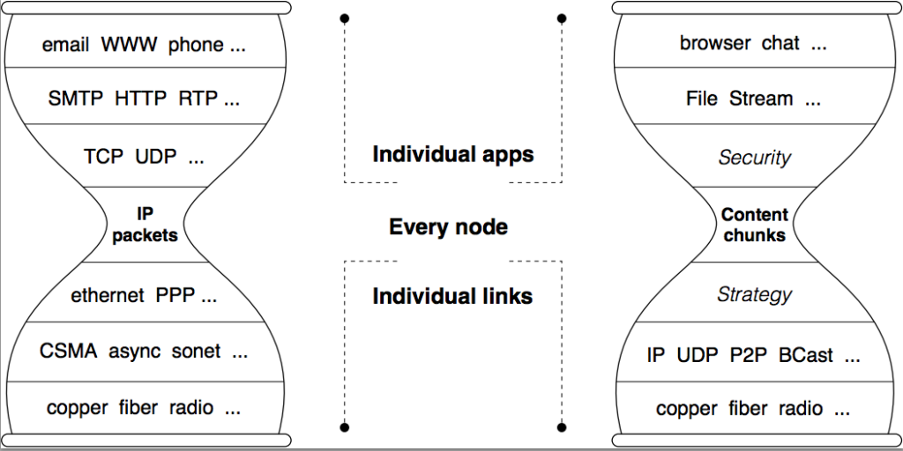

# Introducción a la Capa de Aplicación

La capa de aplicación es esencial para que las aplicaciones de usuario puedan comunicarse a través de redes. Al proporcionar servicios como la interfaz de usuario, la definición de protocolos y el manejo de errores, permite que los usuarios interactúen con las aplicaciones de manera transparente y eficiente.

- Provee servicios de comunicación a los usuarios y a las aplicaciones, incluye a las aplicaciones mismas.
- Brinda la interfaz con el usuario (User Interface UI) u otras aplicaciones/servicios

## Protocolo HTTP (hasta 1.1) y Web-Cache

### Elementos de la web

- ***Recurso u Objeto HTTP:***
    
    Es cualquier cosa que puede ser identificado por una ***URI (Uniform Resource Identifier)*** y que puede ser transferido a través del protocolo HTTP. Es cualquier elemento que puede ser solicitado y recibido a través de una dirección web. Ejemplos:
    
    - Páginas web: El contenido HTML que vemos en un navegador. Puede incluir vínculos o directamente otros objetos.
    - Imágenes: Archivos gráficos como JPEG, PNG, GIF.
    - Videos: Archivos multimedia como MP4, WebM.
    - Archivos: Documentos PDF, archivos de texto, hojas de cálculo, etc.
    - Datos: JSON, XML, CSV, etc.
    - Servicios web: Interfaces que permiten a diferentes aplicaciones comunicarse entre sí.
- ***URI (Uniform Resource Identifier):***
    
    Un URI es un identificador único para un recurso en internet. Como podría ser  una dirección o un nombre que te redirecciona a un lugar específico en la web. Un URI puede ser una página web, una imagen, un video o cualquier otro tipo de recurso digital.
    
- ***URL (Uniform Resource Locator):***
    
    Una URL es un tipo específico de URI. A diferencia de un URI genérico, una URL te dice no solo qué recurso estás buscando, sino también **dónde** se encuentra ese recurso.
    
    Ejemplo: `https://www.example.com/imagen.jpg` es una URL. Te dice que el recurso es una imagen JPEG y que se encuentra en el servidor `www.example.com`.
    
    Formato de una URL: `protocol://[user:pass@]host:[port]/[path]`. Ejemplo: `http://www.NN.unlp.edu.ar:8080/dir/index.html`
    
- ***URN (Uniform Resource Name):***
    
    Un URN es otro tipo de URI. A diferencia de una URL, un URN no te dice dónde se encuentra el recurso, sino que simplemente lo **identifica** de forma única. Solo identifican, categorías, poco implementado. Ejemplo: urn:isbn:0132856204, urn:ietf:rfc:2616.
    
    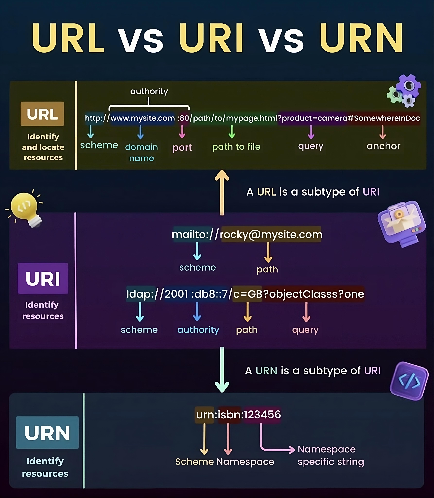
    

### Funcionamiento de HTTP

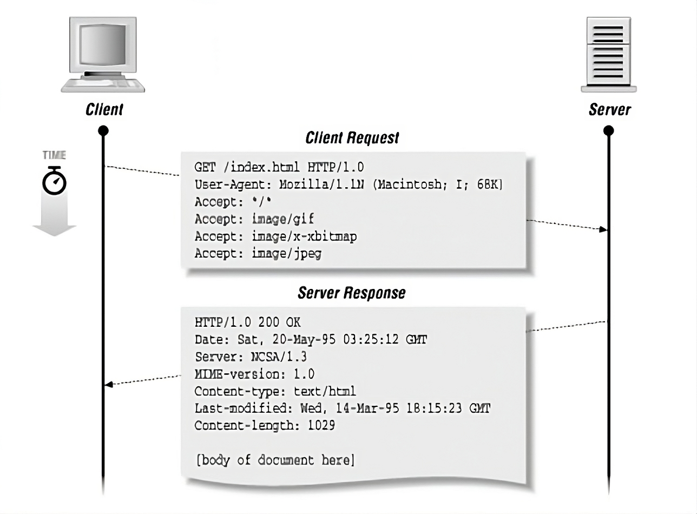

1. ***Solicitud:*** Cuando se ingresa una dirección web en el navegador, se envía una solicitud HTTP al servidor donde se encuentra alojado el sitio. Esta solicitud incluye un método (como GET, POST, PUT, etc) que indica que acción se quiere realizar y una URL que especifica el recurso solicitado.
2. ***Respuesta:*** El servidor recibe la solicitud y procesa la información. Luego envía una respuesta HTTP al cliente (el navegador) donde se incluye un código de estado (por ejemplo 200 para éxito, 404 para no encontrado, etc) y el contenido solicitado, como una página HTML, una imagen, un archivo, etc.

***Utiliza un modelo Cliente-Servidor***

Donde el ***Cliente*** generalmente es un navegador web, pero también pueden ser aplicaciones móviles, bots, o cualquier otro programa que pueda realizar solicitudes HTTP.

El ***Servidor*** es un programa que escucha en un puerto específico, generalmente el 80 (para HTTP) o el 443 (para HTTPS), esperando solicitudes. Cuando recibe una solicitud, la procesa y envía una respuesta. Algunos servidores pueden ser:  Apache Server, MS IIS, NGINX , Google GWS, Tomcat, etc

***Corre sobre el protocolo TCP***

Utiliza el protocolo de control de transmisión. Es un protocolo confiable que garantiza la entrega de los datos en el orden correcto y sin pérdidas, estableciendo una conexión entre el cliente-servidor antes de enviar los datos.

Es un ***protocolo sin memoria de estado,*** ya que no mantiene ninguna información acerca de los clientes.

Trabaja sobre texto ***ASCII (American Standard Code for Information Interchange),*** y permite ******enviar información binaria con ***encabezados MIME.***

Los encabezados MIME son parte de los mensajes HTTP y se utilizan para proporcionar información adicional sobre el contenido del mensaje, como el tipo de contenido (”image/jpg”, “text/html”), la codificación del contenido, etc. ¿Cómo funciona esto en la práctica?

Cuando se envía un archivo binario (como una imagen) a través de HTTP, se realiza lo siguiente:

1. **Codificación:** Los datos binarios se codifican en un formato textual, como Base64. Esto permite que los datos puedan ser representados como texto ASCII y, por lo tanto, puedan ser transmitidos a través de HTTP.
2. **Encabezados MIME:** Se agrega un encabezado MIME al mensaje HTTP para indicar que el contenido es de tipo binario y cuál es su codificación. Por ejemplo: `Content-Type: image/jpeg;base64`.
3. **Transmisión:** El mensaje HTTP, incluyendo los datos codificados y los encabezados MIME, se envía al servidor o al cliente.
4. **Decodificación:** En el extremo receptor, los datos se decodifican del formato Base64 a su formato binario original.

### Versión HTTP 0.9

Primera versión de HTTP que nunca se estandarizó

Pasos para obtener un documento:

1. Establecer la conexión TCP con el servidor web en el puerto 80.
2. Enviar la solicitud (HTTP request) vía comando GET y el nombre del documento a solicitar (GET /index.html).
3. Recibir la solicitud (HTTP response) con el archivo solicitado.
4. Cerrar la conexión TCP por parte del servidor.
5. Si no existe el documento o hay un error, directamente se cierra la conexión.

Solo había una forma de requerimiento y una sola forma de respuesta, además de que el request/response eran sin estado.

### Versión HTTP 1.0

Versión de HTTP 1.0 estándar (RFC-1945)

- Se construye sobre HTTP 0.9, se debe especificar la versión en el requerimiento del cliente. Los clientes HTTP deben indicar en sus solicitudes cuál es la versión del protocolo que se está utilizando. Ej: “HTTP/1.0”.
- Para los Request se definen diferentes métodos HTTP:
    - GET (para solicitar un recurso): obtener el documento requerido. Puede enviar información, pero no demasiada. Es enviada en la URL. Formato `?var1=val1&var2=val2...`. Limitación de tamaño de URL por parte de las implementaciones. NO espera recibir datos en body.
    - HEAD (para solicitar solo los encabezados de una respuesta): idéntico a GET, pero sólo requiere la meta información del documento, por ejemplo, su tamaño. Usado por clientes con caché.
    - POST (para enviar datos a un servidor): hace un requerimiento de un documento, pero también envía información en el Body. Generalmente, usado en el fill-in de un formulario HTML(FORM). Puede enviar mucha más información que un GET.
    - PUT (para almacenar un recurso en el servidor): usado para reemplazar un documento en el servidor. En general, deshabilitada. Utilizado, por ejemplo, por protocolos montados sobre HTTP, como WebDAV [WDV].
    - DELETE (para eliminar un recurso en el servidor). usado para borrar un documento en el servidor. En general, deshabilitada. También, puede ser utilizada por WebDAV.
    - LINK / UNLINK: establecen/des-establecen relaciones entre documentos.
- Además se definen códigos de respuesta, 200 OK (solicitud completada con éxito), 404 Not Found (el recurso solicitado no se encontró), 500 Internal Server Error (ocurrió un error en el servidor).
- Se admiten repertorio de caracteres, además del ASCII, como: ISO-8859-1, UTF-8, etc.
- Admite MIME (no solo sirve para descargar HTML e imágenes):
- Por default no utiliza conexiones persistentes:

**Request and Response:**

```bash
<Method> <URI> <Version>
[<Headers Opcionales>]
<Blank>
[<Entity Body Opcional>]
<Blank>

<HTTP Version> <Status Code> <Reason Phrase>
[<Headers Opcionales>]
<Blank>
[<Entity Body Opcional>]
```

- GET/Repsonse HTTP 1.0
    
    ```bash
    GET /index2.html HTTP/1.0
    User-Agent: telnet/andres (GNU/Linux)
    Host: estehost.com
    Accept: */*
    
    HTTP/1.1 200 OK
    Date: Mon, 21 Apr 2008 00:28:51 GMT
    Server: Apache/2.2.4 (Ubuntu)
    Last-Modified: Mon, 21 Apr 2008 00:18:14 GMT
    ETag: "a3b36-1f-91d5d80"
    Accept-Ranges: bytes
    Content-Length: 31
    Connection: close
    Content-Type: text/plain
    <HTML>
    <H1> HOLA </H1>
    ...
    </HTML>
    ```
    
- HEAD / Response HTTP 1.0
    
    ```bash
    HEAD /index.html HTTP/1.0
    User-Agent: telnet/andres (GNU/Linux)
    Host: estehost.com
    Accept: */*
    
    HTTP/1.1 200 OK
    Date: Mon, 21 Apr 2008 00:40:25 GMT
    Server: Apache/2.2.4 (Ubuntu)
    Last-Modified: Mon, 21 Apr 2008 00:18:14 GMT
    ETag: "a3b36-1f-91d5d80"
    Accept-Ranges: bytes
    Content-Length: 31
    Connection: close
    Content-Type: text/plain
    ```
    
- POST / Response
    
    ```bash
    POST /index.html HTTP/1.0
    User-Agent: telnet/andres (GNU/Linux)
    Host: estehost.com
    Accept: */*
    Content-Type: text/plain
    Content-Length: 10
    
    1234567890
    
    HTTP/1.1 200 OK
    Date: Mon, 21 Apr 2008 00:37:22 GMT
    Server: Apache/2.2.4 (Ubuntu)
    Last-Modified: Mon, 21 Apr 2008 00:18:14 GMT
    ETag: "a3b36-1f-91d5d80"
    Accept-Ranges: bytes
    Content-Length: 31
    Connection: close
    Content-Type: text/plain
    <HTML>
    <H1> HOLA </H1>
    ...
    </HTML>
    ```
    

**HTTP/1.0 con conexiones persistentes**

- En HTTP 1.0 no se contemplaron las conexiones persistentes, esto fue a partir de HTTP 1.1
- La conexión persistente se solicitaba de forma explícita a través de un encabezado especial en sus solicitudes. El cliente era quien indicaba al servidor que quería mantener una conexión persistente abierta para futuras solicitudes.
    
    ```bash
    GET /index.html HTTP/1.0
    Connection: Keep-Alive
    User-Agent: telnet/andres (GNU/Linux)
    Host: estehost.com
    Accept: */*
    
    HTTP/1.1 200 OK
    Date: Tue, 22 Apr 2008 01:31:56 GMT
    Server: Apache/2.2.4 (Ubuntu)
    Last-Modified: Mon, 21 Apr 2008 00:18:14 GMT
    ETag: "a3b36-1f-91d5d80"
    Accept-Ranges: bytes
    Content-Length: 31
    Keep-Alive: timeout=15, max=10
    Connection: Keep-Alive
    Content-Type: text/html
    <HTML>
    <H1> HOLA </H1>
    </HTML>
    
    GET /index.html HTTP/1.0
    Connection: Keep-Alive
    ...
    Connection closed by foreign host.
    ```
    

**HTTP 1.1**

HTTP/1.1, actualización significativa respecto a  HTTP/1.0. La primera versión de la especificación fue publicada en 1997 y se documentó en el RFC 2068 que posteriormente fue revisada y actualizada con la nueva versión documentada en el RFC 2616.

***Nuevos mensajes HTTP/1.1*** (acciones que un cliente puede realizar sobre un recurso):

- OPTIONS: permite a un cliente descubrir las opciones de comunicación que un servidor soporta.
- TRACE: envía la solicitud recibida de vuelta al cliente, lo que es útil para diagnóstico. Utilizada para debbugin principalmente para depurar problemas de comunicación entre el cliente y el servidor. En algunos casos se puede utilizar para detectar servidores que no implementan correctamente las especificaciones HTTP y podrían ser vulnerables a ataque.
- CONNECT: Se utiliza para establecer una conexión túnel a través de un servidor proxy. En lugar de enviar una conexión TCP directa entre el cliente y un servidor destino, pasando por el proxy. Se utilizan comunmente en proxies que permiten conexiones directas a servidores que no utilizan HTTP. También en algunos casos se puede utilizar para establecer conexiones VPN a través de un proxy HTTP.

***Conexiones persistentes por omisión:***

Se mantiene una conexión abierta entre el cliente y servidor para múltiples solicitudes, en lugar de cerrar la conexión después de cada solicitud. Característica activa de forma predeterminada en HTTP 1.1.

***Pipelining, mejora tiempo de respuestas:***

El pipelining permite enviar múltiples solicitudes a través de una sola conexión, sin esperar la respuesta a la solicitud anterior.

Al enviar múltiples solicitudes de forma simultánea, se reduce el tiempo total de espera para recibir todas las respuestas, mejorando la velocidad de carga de las páginas web (no necesita esperar la respuesta para pedir otro objeto HTTP).

Sobre la misma conexión se debe mantener el orden de los objetos que se devuelve.

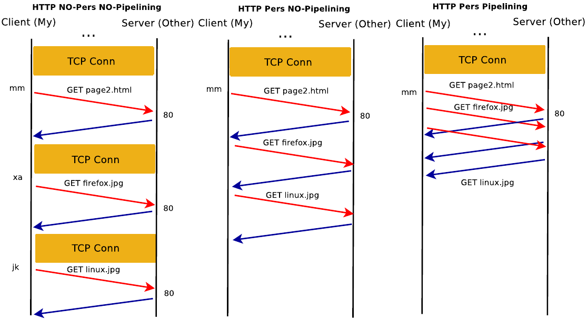

**CGIs Script y Javascript**

Los CGIs son programas externos que se ejecutan en un servidor web cuando se recibe una solicitud HTTP específica. Estos scripts, generalmente escritos en lenguajes como Perls, Python o C, permiten generar contenido dinámico en una página web.

- **CGIs:** Se ejecutan en el servidor para generar contenido dinámico basado en las solicitudes del usuario. Son menos utilizados hoy en día debido a su complejidad y a la existencia de alternativas más modernas.
- **JavaScript:** Se ejecuta en el navegador para crear interfaces de usuario interactivas y mejorar la experiencia del usuario. Es el lenguaje más utilizado para el desarrollo web frontend.

**¿Cuál es la diferencia clave entre CGIs y JavaScript?**

- **Ubicación de la ejecución:** CGIs se ejecutan en el servidor, mientras que JavaScript se ejecuta en el navegador.
- **Propósito:** CGIs se utilizan principalmente para generar contenido dinámico, mientras que JavaScript se utiliza para crear interfaces de usuario interactivas y manipular el DOM.
- **Complejidad:** CGIs suelen ser más complejos de configurar y mantener, mientras que JavaScript es más fácil de aprender y usar.

**En la actualidad, la combinación de ambos es común:**

- **Servidor:** Se utilizan lenguajes como PHP, Python o Node.js para crear APIs que proporcionan datos al frontend.
- **Cliente:** JavaScript (con frameworks como React, Angular o Vue) se utiliza para crear interfaces de usuario interactivas que consumen los datos de las APIs.

### Cookies

**Mecanismo que permite a las aplicaciones web del servidor “manejar estados”.**

El servidor puede recordar información sobre visitas anteriores. Por ejemplo, si se inicia sesión en un sitio web, el servidor “recuerda” que se está autenticado gracias a una cookie. Gracias a las cookies los sitios pueden ofrecer una experiencia más personalizada, como puede ser el mostrar recomendaciones de productos basados en compras anteriores o recordar preferencias de configuración.

**El cliente hace un request y el servidor retorna un recurso indicando al cliente que almacene determinados valores por un tiempo.**

Cuando el servidor envía una página web solicitada, puede incluir una cookie en la respuesta. Esta cookie contiene información que el servidor quiere que el navegador almacene.

**La cookie es introducida al cliente mediante el mensaje en el header `Set-cookie:`** 

Este header específicamente indica al navegador que debe almacenar una nueva cookie con el nombre y valor especificados.

**El cliente en cada requerimiento luego de haber almacenado la cookie se la enviará al servidor con el header `Cookie:`** 

Cada vez que se visite ese sitio web, el navegador enviará automáticamente la cookie al servidor en el header `Cookie:` . De esta manera, el servidor puede identificar al usuario que está accediendo al sitio web.

**Esta información puede ser usada por cliente-side scripts.**

Los scripts del lado del cliente, como JavaScript, pueden acceder a la información almacenada en las cookies. Esto permite crear páginas web más dinámicas e interactivas.

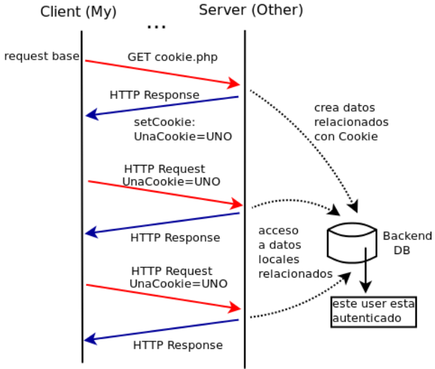

### Web-Cache

**“Proxiar” y “Cachear” recursos HTTP.**

- ***Proxiar:*** Significa que un servidor proxy actúa como intermediario entre un cliente (tu navegador) y un servidor web. En lugar de que tu navegador se conecte directamente al servidor web para solicitar un recurso (como una imagen o un archivo CSS), lo hace a través del proxy.
- ***Cachear:*** Significa almacenar una copia de los recursos que se solicitan con frecuencia. Cuando un usuario solicita un recurso, el proxy verifica si tiene una copia almacenada en su caché. Si la tiene, se la envía al usuario directamente, sin necesidad de volver a solicitarla al servidor original.

**Objetivos:**

- **Mejorar tiempo de respuesta (reducir retardo en descarga):** Al tener una copia local de los recursos más solicitados, el proxy puede servirlos mucho más rápido que si tuviera que descargarlos nuevamente del servidor original cada vez. Esto reduce el tiempo de carga de las páginas web y mejora la experiencia del usuario.
- **Ahorro de BW (recursos de la red):** Al reducir el número de veces que se solicitan los mismos recursos al servidor original, se disminuye el tráfico de red. Esto es especialmente beneficioso en redes con ancho de banda limitado o cuando se tienen muchos usuarios accediendo al mismo contenido.
- **Balance de carga, atender a todos los clientes:** Los servidores proxy pueden distribuir la carga de las solicitudes entre varios servidores web, lo que ayuda a evitar que un solo servidor se sobrecargue. Esto mejora la disponibilidad y el rendimiento del servicio.

**¿Cómo funciona el proceso de cacheo?**

- Se solicita el objeto. Cuando un usuario solicita un recurso, esta solicitud llega primero al servidor proxy.
- Si esta en cache y está “fresco” se retorna desde allí (HIT). Si el proxy tiene una copia actualizada del recurso (es decir, si no ha caducado), se lo envía directamente al usuario. A esto se le llama un "hit" de caché.
- Si el objeto no está o es viejo se solicita al destino y se cachea. Si el proxy no tiene una copia del recurso o si la copia que tiene está caducada, se la solicita al servidor original y se almacena una nueva copia en el caché.

**Caché del lado del cliente (privada)**

Hay una copia local de los recursos web (imágenes, hojas de estilo, scripts, etc.) que el navegador almacena en el dispositivo. 

El objetivo principal es acelerar la carga de las páginas web que uno como cliente visita frecuentemente. Al tener una copia local de estos recursos, el navegador no necesita descargarlos nuevamente del servidor cada vez que se los requiere, lo que reduce el tiempo de carga.

Se llama privada porque esta caché es específica del dispositivo personal que se esté usando para acceder a ese sitio web.

**Los web browser tienen sus propias caché locales.**

Cada navegador tiene su propia caché, lo que significa que el navegador (Edge, Chrome, Brave, etc.) gestiona su propia caché de forma independiente. Se pueden configurar las opciones de caché del navegador para controlar cuánto espacio se utiliza para almacenar los archivos en caché y cuánto tiempo se conservan.

**Los servidores agregan headers.**

- Last-Modified: Esta cabecera indica la última fecha y hora en el que el recurso fue modificado en el servidor.
- ETag: Es como una huella digital del recurso. Es un valor único que identifica una versión específica del recurso.

**Requerimientos condicionales desde los clientes.**

- If-Modified-Since: Cuando el navegador envía una solicitud, puede incluir este encabezado con la fecha de la última versión del recurso que tiene almacenada en su caché. El servidor compara esta fecha con la fecha de modificación del recurso y decide si enviar una nueva versión o no.
- If-None-Match: Este encabezado se utiliza con el ETag. El navegador envía el ETag del recurso que tiene almacenado y el servidor compara este valor con el ETag actual del recurso.

**Respuesta de los servidores**.

- 304 Not Mofidied: Si el recurso no ha sido modificado desde la última vez que fue solicitado. el servidor envía este código de estado. Esto indica al navegador que utilice la versión que ya tiene en caché.
- 200 OK: Si el recurso ha sido modificado, el servidor envía este código de estado junto con la nueva versión del recurso y actualiza el valor de Last-Modified y ETag en la respuesta.

**Funcionamiento del proceso**

***Primera solicitud:*** Cuando se visita una página por primera vez, el navegador realiza una solicitud HTTP al servidor para descargar todos los recursos necesarios. Estos recursos se almacenan en la caché del navegador, junto con la información sobre cuándo fueron modificados por última vez o un identificador único de contenido (ETag).

***Solicitudes posteriores:*** Al volver a visitar la página, el navegador intentará utilizar los recursos que ya tiene en caché para acelerar la carga. Para verificar si los recursos en caché están actualizados, el navegador envía una solicitud condicional al servidor, incluyendo los encabezados `If-Modified-Since` y/o `If-None-Match`

***Respuesta del servidor:*** El servidor utiliza la información proporcionada por el navegador para determinar si el recurso ha cambiado o no desde la última solicitud. 

Si el recurso NO cambió, el servidor responde con un código de estado 304 Not Modified, indicando que la versión en caché del navegador es válida y puede ser utilizada, evitando que el servidor vuelva a enviar los recursos así ahorrar ancho de banda y acelerando el tiempo de carga de la página.

Si el recurso cambió, el servidor envía un código de estado 200 OK junto con la nueva versión del recurso actualizado, reemplazando la versión antigua en la caché con la nueva.

**Los caché como servidores funcionan como Proxy (shared caché).**

Esto significa que un servidor caché actúa como intermediario entre los clientes (dispositivos) y los servidores web desde se alojan los sitios web. Es llamado “shared caché”, porque este tipo de caché es como una estantería donde se guardan las “páginas web” para que todos los usuarios puedan acceder a ellos rápidamente.

**Son servidores a los clientes y clientes a los servidores web.**

Desde el punto de vista de un cliente, el servidor caché parece el servidor web al que está conectado y desde el punto de vista del servidor web, el servidor caché es otro cliente que le está solicitando recursos.

**Los instan ISP o redes grandes que desean optimizar el uso de los recursos**

Estos proveedores de servicio tienen una gran cantidad de usuarios y, por lo tanto, un gran volumen de tráfico. Al instalar servidores caché, pueden reducir la carga en sus redes y mejorar la velocidad de acceso a internet para sus clientes.

**Tipos de Proxy**

- Proxy no transparente: El usuario es consciente de la existencia del proxy. Por ejemplo cuando se tiene que configurar manualmente la dirección del proxy en un navegador.
- Proxy transparente: El usuario no es consciente de la existencia del proxy. El tráfico se redirige automáticamente al proxy sin ninguna configuración por parte del usuario.
- Proxy en jerarquía o mesh (ICP y HTCP): Estos son sistemas más complejos de servidores caché que se comunican entre sí para compartir información sobre qué recursos tienen almacenados. Esto permite una distribución más eficiente del contenido y una mejor utilización de los recursos.
- CDN (Content Delivery Network): Una red de entrega de contenido es una red distribuida de servidores que almacenan copias de contenido estático (imágenes, archivos CSS, JavaScript) en ubicaciones geográficas estratégicas. Los CDN utilizan el sistema DNS para dirigir a los usuarios al servidor más cercano, lo que reduce la latencia y mejora el rendimiento.

## HTTP 2

### Qué es HTTP 2?

**Reemplazo de como HTTP se transporta**

Cambio fundamental en la forma en la que se envían los datos en HTTP. A diferencia de HTTP/1.1, que utiliza un formato textual para las solicitudes y respuestas, ***HTTP/2 emplea una codificación binaria.*** Esto significa que los datos se representan como una secuencia de bytes, lo que permite una transmisión más eficiente y rápida.

**No es un reemplazo del protocolo completo**

Aunque HTTP/2 introduce cambios significativos en el nivel de transporte, ***no modifica la semántica del protocolo HTTP.*** Esto quiere decir que los métodos HTTP (GET, POST, PUT, DELETE, etc.) y los códigos de estado (200 OK, 404 Not Found, etc.) siguen siendo y funcionando igual. En otras palabras, la forma en la que las aplicaciones interactúan con el servidor no cambia.

**Base del trabajo protocolo desarrollado por Google SPDY/2**

SPDY(Speedy) fue un protocolo experimental desarrollado por Google con el objetivo de mejorar el rendimiento de las páginas web. ***HTTP/2 se basa en gran medida en SPDY***, adoptando muchas de sus características y mejoras. SPDY demostró ser muy eficaz en la reducción de la latencia y el aumento de la velocidad de carga de las páginas web, lo que llevó a su estandarización como HTTP/2.

**RFC7540: Hypertext Transfer Protocol version 2.** 

Este documento define las especificaciones principales de HTTP/2, incluyendo la estructura de los frames, la multiplexación, la compresión de encabezados y otros aspectos clave del protocolo.

**RFC7541: HPACK - Header Compression for HTTP/2.** Este RFC se centra específicamente en la técnica de compresión de encabezados utilizada en HTTP/2, llamada HPACK. La compresión de encabezados es fundamental para mejorar el rendimiento de HTTP/2 al reducir el tamaño de los mensajes intercambiados entre el cliente y el servidor.

### Problemas de HTTP/1.0 y HTTP/1.1 y sus Soluciones

**Un Request por conexión, por vez, muy lento.**

Cada solicitud requería una nueva conexión TCP. Esto implicaba abrir y cerrar una conexión para cada elemento de una página web, lo que generaba una considerable sobrecarga y ralentizaba la carga de las páginas.

**Alternativas (evitar HOL)**

***Conexiones persistentes:*** En lugar de cerrar la conexión después de cada solicitud, se mantenía abierta para enviar y recibir mútiples solicitudes. Esto reducía el tiempo de establecimiento de la conexión, pero seguía teniendo limitaciones.

***Pipelining:*** Permitía enviar múltiples solicitudes a través de una conexión sin esperar la respuesta anterior. Sin embargo requería que las respuestas se enviaran en el mismo orden que las solicitudes, lo que podía generar bloqueos si una respuesta se demoraba.

***Generar conexiones paralelas:*** Se abrían múltiples conexiones simultáneas al servidor para descargar diferentes recursos en paralelo. Esta estrategia, aunque efectiva, podía sobrecargar el servidor y la red si no se controlaba adecuadamente.

**Problemas**

***Head of Line Blocking (HOL):*** Si una solicitud en un pipeline se bloqueaba (por ejemplo, debido a un error de red), todas las solicitudes posteriores también se bloqueaban, afectando el rendimiento de la página.

***Limitaciones del pipelining:*** No todos los métodos HTTP podían ser utilizados en pipelining, lo que limitaba su aplicabilidad (POST).

***Sobrecarga de conexiones:*** Generar demasiadas conexiones paralelas podía saturar la red y causar problemas de rendimiento.

***Duplicación de encabezados:*** Cada solicitud HTTP incluía una cabecera con información sobre la conexión, el tipo de contenido, etc. Al enviar múltiples solicitudes, se enviaban los mismos encabezados repetidamente, lo que generaba una sobrecarga de datos.

### Diferencias principales con HTTP/1.1

**Protocolo binario en lugar de ASCII y Binary Framing**

Al utilizar un ***formato binario***, HTTP/2 recude la sobrecarga de los datos, ya que no necesita codificar cada caracter individualmente. Esta información se divide en unidades más pequeñas llamadas ***frames***, lo que facilita la multiplexación y el control de flujo.

**Multiplexación de múltiples request**

En lugar de abrir una nueva conexión para cada solicitud, HTTP/2 permite enviar múltiples solicitudes a través de una sola conexión TCP. Al eliminar la necesidad de establecer nuevas conexiones para cada recurso, se reduce significativamente la latencia. Los recursos se pueden cargar en paralelo, lo que significa que si un recurso se demora, no bloquea la carga de los demás.

**Datos Fuera de Orden, Priorización y Control de Flujo por Frame**

**Flexibilidad:** Los datos pueden llegar al cliente en un orden diferente al que fueron enviados, lo que permite al servidor optimizar la entrega de los recursos.

**Priorización:** El cliente puede indicar la importancia de cada solicitud, permitiendo que los recursos críticos se carguen primero.

**Control de Flujo:** El mecanismo de control de flujo por frame evita que el cliente se inunde con datos, asegurando un uso eficiente de los recursos.

**Compresión de los encabezados**

Hay reducción del tamaño de los mensajes, ya que HTTP/2 utiliza una técnica de compresión llamada HPACK para reducir el tamaño de los encabezados HTTP.

**Server Push**

Los servidores pueden predecir qué recursos necesitará un cliente y enviarlos de forma proactiva, incluso antes de que el cliente los solicite. Esto reduce el número de viajes de ida y vuelta entre el cliente y el servidor.

**Mayoría de las implementaciones requieren TSL/SSL.**

Aunque no es un requisito estricto del estándar HTTP/2, la mayoría de las implementaciones utilizan TSL/SSL para proporcionar privacidad y seguridad en la comunicación. 

**TLS** (Transport Layer Security) y su predecesor **SSL** (Secure Sockets Layer) son protocolos criptográficos diseñados para asegurar las comunicaciones a través de una red, como Internet. Estos protocolos establecen una conexión cifrada entre un cliente (por ejemplo, un navegador web) y un servidor (un sitio web), garantizando la confidencialidad, integridad y autenticidad de los datos transmitidos.

### HTTP/2 mux stream, framing

**Conexiones TCP y HTTP**

HTTP/2 puede utilizar una o más conexiones TCP. Sin embargo la tendencia es aprovechar las conexiones existentes para reducir la sobrecarga.

**Características de los Streams**

**ID único:** Cada stream tiene un identificador único que lo distingue de otros streams dentro de la misma conexión.

**Prioridad:** Los streams pueden tener una prioridad asignada, lo que permite al servidor y al cliente determinar qué streams deben procesarse primero. Esto es útil para garantizar que los recursos críticos se carguen más rápido.

**Bidireccionalidad:** Los streams pueden ser utilizados tanto para enviar solicitudes desde el cliente al servidor como para recibir respuestas del servidor al cliente.

**Multiplexación de los Streams**

HTTP/2 permite multiplexar múltiples streams sobre una única conexión TCP pudiendo enviar y recibir múltiples solicitudes y respuestas de forma simultánea. La multiplexación reduce la latencia y sobrecarga asociada con nuevas conexiones TCP para cada solicitud.

**Framing de mensajes**

**División en frames:** Los mensajes HTTP/2 se dividen en unidades más pequeñas llamadas **frames**. Un frame consta de un encabezado fijo que contiene información sobre el tipo de frame, el stream al que pertenece, y una carga útil variable que contiene los datos del mensaje.

**Unidad mínima de transmisión:** El frame es la unidad mínima de datos que se puede enviar a través de una conexión HTTP/2.

**Flexibilidad:** Un mismo stream puede transportar diferentes tipos de mensajes, ya que cada mensaje se divide en frames individuales.

**Tipos de Frames**

HEADERS: Contienen los encabezados HTTP de una solicitud o respuesta. Estos encabezados son los mismos que se utilizan en HTTP/1.1, pero están comprimidos utilizando HPACK para mejorar la eficiencia.

DATA: Transportan el cuerpo de la solicitud o respuesta. Es decir, los datos reales que se están enviando o recibiendo.

PUSH_PROMISE: Permite al servidor "empujar" recursos al cliente de forma proactiva, antes de que el cliente los solicite. Esto puede mejorar el rendimiento al reducir el número de viajes de ida y vuelta entre el cliente y el servidor.

WINDOW_UPDATE: Se utiliza para controlar el flujo de datos entre el cliente y el servidor. Cada stream tiene una ventana de flujo que indica la cantidad de datos que el receptor está dispuesto a recibir.

SETTINGS: Se utilizan para configurar parámetros de la conexión, como la máxima ventana de flujo inicial o el tamaño máximo de un frame.

PING: Se utilizan para mantener viva la conexión y medir la latencia.

RST_STREAM: Se utiliza para restablecer un stream de forma abrupta.

PRIORITY: Se utiliza para cambiar la prioridad de un stream.

CONTINUATION: Se utiliza para continuar un frame de encabezados que es demasiado grande para caber en un solo frame.

**Relación stream con conexión**

Cada stream transporta una secuencia de frames. Los frames de un mismo stream comparten un mismo identificador de stream.

Todos los stream de una conexión comparten una misma conexión TCP. La multiplexación permite que múltiples streams coexistan en una sola conexión.

Ejemplo práctico de ****una solicitud HTTP para descargar una página web. Esta solicitud se dividiría en múltiples frames:

1. **HEADERS:** Contiene los encabezados de la solicitud, como el método (GET), la URL y los encabezados de cookies.
2. **DATA:** Si la solicitud incluye un cuerpo (por ejemplo, en una solicitud POST), los datos del cuerpo se enviarían en uno o más frames de tipo DATA.
3. **HEADERS:** El servidor respondería con un frame HEADERS que contiene los encabezados de la respuesta, incluyendo el código de estado (200 OK), el tipo de contenido y otros encabezados.
4. **DATA:** Los datos de la página web se enviarían en múltiples frames de tipo DATA.
5. **PUSH_PROMISE:** Si el servidor detecta que el cliente necesitará otros recursos (como imágenes o scripts), puede enviar frames PUSH_PROMISE para comenzar a enviar esos recursos de forma proactiva.

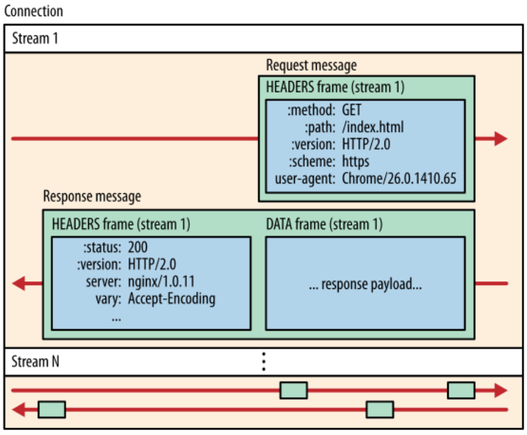

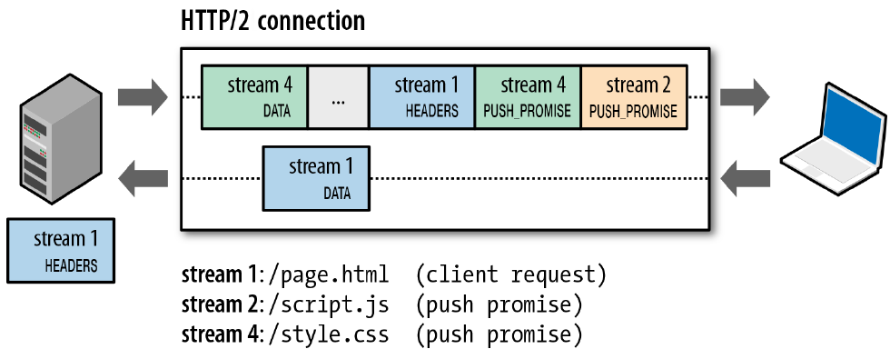

### Headers HTTP/2

Cambian la forman en la que se escriben y se estructuran respecto a HTTP/1, además de que no se codifican más en ASCII, se utiliza una representación binaria más eficiente. 

Surgen nuevos pseudo-headers que comienzan con dos puntos (:) y contienen información que antes estaba dispersa en el método HTTP, la URL y otros encabezados.

Los pseudos-headers ofrecen varias ventajas:

- Claridad: agrupan información relacionada en un solo lugar, haciendo que los mensajes HTTP/2 sean más fáciles de analizar.
- Flexibilidad: permiten una mayor flexibilidad en la definición de nuevos esquemas de URI y métodos HTTP.
- Eficiencia: facilitan la comprensión de encabezados.

Ejemplos:

**:method:** Especifica el método HTTP (GET, POST, PUT, etc.).

**:path:** Indica la ruta de la solicitud.

**:scheme:** Indica el esquema utilizado (http o https).

**:authority:** Reemplaza al encabezado `Host` de HTTP/1.1 y especifica el nombre del host.

**:status:** Indica el código de estado de una respuesta (200 OK, 404 Not Found, etc.).

```bash
HTTP/1.1:
GET /algo HTTP/1.1
Host: www.site.com

HTTP/2:
:method: GET
:path: /algo
:scheme: http
:authority: www.site.com
```

### HTTP/2 priorización y flow-control

**Flow Control Individual de los Streams**

¿Qué es? Cada stream en HTTP/2 tiene su propio mecanismo de control de flujo. Esto significa que el receptor (cliente o servidor) puede indicar al emisor cuánto espacio libre tiene en su buffer para recibir datos.

¿Por qué es útil? Evita que el receptor se sature con datos, lo que podría provocar pérdidas de paquetes y retrasar la carga de la página.

**Priorización de Streams**

- Weight: Los streams pueden tener asignado un peso (weight), que determina su prioridad relativa en comparación con otros streams. Un peso mayor indica una prioridad más alta.
- Jerarquía: Los streams pueden estar organizados en una jerarquía, donde un stream padre puede tener varios streams hijos. Los streams hijos heredan la prioridad de su padre.
- Dependencias: Los streams pueden tener dependencias entre sí. Por ejemplo, un stream que representa una imagen puede depender de un stream que representa el CSS que define el estilo de la imagen.

### Inline vs. Push en HTTP/2

**Inline** y **push** son dos estrategias diferentes que un servidor HTTP/2 puede utilizar para enviar recursos a un cliente. Ambas tienen sus ventajas y desventajas, y la elección de una u otra dependerá de varios factores, como la naturaleza de la aplicación y las necesidades del usuario.

***Inline:*** El cliente solicita un recurso (por ejemplo, la página HTML principal) y el servidor responde con ese recurso. El cliente luego "parsea" el HTML y encuentra referencias a otros recursos (como hojas de estilo CSS o scripts JavaScript). En ese momento, el cliente realiza nuevas solicitudes para obtener esos recursos adicionales.

- Ventajas:

    - Simple: Es el enfoque más sencillo y tradicional.
    - Flexible: Permite al cliente tener un control total sobre qué recursos cargar.

- Desventajas:
    - Mayor latencia: Cada recurso adicional requiere una nueva solicitud, lo que puede aumentar la latencia y retrasar la carga de la página.
    - Bloqueo de renderizado: Si un recurso crítico (como un estilo CSS) tarda en cargar, puede bloquear el renderizado de la página.

***Push:*** El servidor, al enviar la página HTML principal, puede "empujar" (push) otros recursos que anticipa que el cliente necesitará, como hojas de estilo o scripts. Esto se hace de forma proactiva, sin que el cliente tenga que solicitarlos explícitamente.

- Ventajas:

    - Mayor rendimiento: Al enviar los recursos de forma anticipada, se reduce el número de solicitudes y se acelera la carga de la página.
    - Mejor experiencia de usuario: La página puede cargarse más rápido y de forma más suave.

- Desventajas:

    - Mayor complejidad: Requiere que el servidor tenga un conocimiento más profundo de la aplicación y de los recursos que suelen necesitar los clientes.
    - Posible sobrecarga: Si se envían demasiados recursos innecesarios, puede aumentar el consumo de ancho de banda y ralentizar la conexión.

**¿Cuándo utilizar cada enfoque?**

- **Inline:**
    - Aplicaciones dinámicas: Cuando el contenido de la página cambia con frecuencia y es difícil predecir qué recursos necesitará el cliente.
    - Aplicaciones con baja latencia: Cuando es crucial minimizar el número de solicitudes y la latencia.
- **Push:**
    - Aplicaciones estáticas: Cuando el contenido de la página cambia con poca frecuencia y se pueden predecir los recursos que necesitará el cliente.
    - Aplicaciones con muchos recursos pequeños: Cuando la página depende de muchos recursos pequeños (como iconos o fuentes), el push puede ayudar a reducir el número de solicitudes.
    


## HTTP/3

**Transportando HTTP sobre Quic**

***QUIC (Quick UDP Internet Connections):*** Es un protocolo de transporte diseñado por Google como una alternativa a TCP. A diferencia de TCP, que es orientado a la conexión y garantiza la entrega ordenada de paquetes, QUIC se basa en UDP (User Datagram Protocol), que es un protocolo no orientado a la conexión y menos confiable.

***UDP:443:*** QUIC utiliza el puerto 443 por defecto, que es el mismo puerto utilizado por HTTPS (HTTP sobre SSL/TLS). Esto permite que HTTP/3 se beneficie de la infraestructura de seguridad ya existente en Internet.

**Conservando la semántica de HTTP/1.1**

HTTP/3 conserva los métodos y semántica de HTTP/1. Esto significa que las solicitudes y respuestas HTTP siguen teniendo la misma estructura y significado que en versiones anteriores.

HTTP/3 representa una evolución de HTTP/2, añadiendo nuevas características para mejorar el rendimiento y eficiencia

**Base de trabajo sobre Quic**

Quic fue desarrollado por Google como una solución a los problemas de rendimiento y latencia que se encuentran en TCP, especialmente en los entornos de red móviles y con alta congestión. Ofrece múltiples streams en una sola conexión UDP, lo que permite enviar múltiples solicitudes y respuestas de forma simultánea. Además incorpora seguridad de forma nativa, eliminando la necesidad de un handshake TSL separado.

**Definiciones formales**

***RFC 9000:*** documento que define el protocolo Quic en detalle, describiendo el funcionamiento, características y mecanismos de seguirdad.

***RFC 9114:*** Documento que se centra específicamente en HTTP/3, explicando cómo se utiliza Quic como el protocolo de transporte para HTTP y detallando las diferencias y mejoras con respecto a HTTP/2.

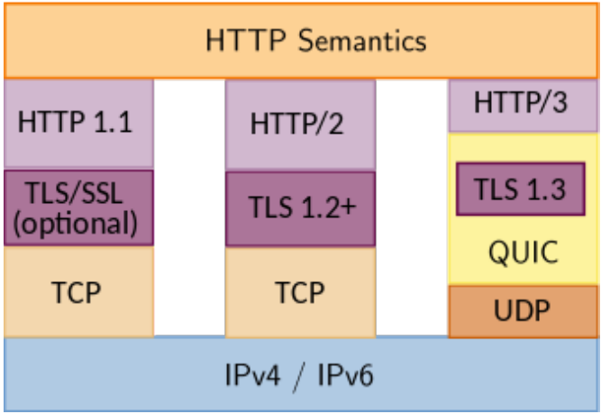

- **HTTP/1.1:**
    - **TLS/SSL:** Opcional. La seguridad se agregaba como una capa adicional.
    - **TCP:** Utilizaba TCP como protocolo de transporte, lo que implicaba una conexión por solicitud y una sobrecarga en el establecimiento de conexiones.
    - **Limitaciones:** Sufría de problemas de rendimiento como el "head of line blocking" y la ineficiencia en el uso de conexiones.
- **HTTP/2:**
    - **TLS 1.2+:** La seguridad se volvió obligatoria, utilizando TLS 1.2 o versiones posteriores.
    - **TCP:** Continuó utilizando TCP como protocolo de transporte, pero introdujo mejoras como la multiplexación de solicitudes en una sola conexión.
    - **Mejoras:** Permite la multiplexación de múltiples solicitudes/respuestas a través de una única conexión TCP, lo que reduce la latencia y mejora el rendimiento en comparación con HTTP/1.1.
- **HTTP/3:**
    - **TLS 1.3:** Utiliza la versión más reciente de TLS para una seguridad aún mayor.
    - **QUIC:** Se basa en QUIC, que utiliza UDP. Ofrece una menor latencia, una mayor eficiencia y una mejor recuperación de errores en comparación con TCP.
    - **Innovaciones:** Introdujo nuevas características como la multiplexación de streams y la reducción de la latencia, lo que lo convierte en el protocolo más rápido y eficiente hasta la fecha.

### Diferencias principales en HTTP/3-Quic

**Reducción de latencia en conexiones (2 msj. de handshake).**

- Handshake más rápido, a diferencia de TCP, que requiere múltiples intercambios de paquetes para establecer una conexión *(three-way handshake)*, Quic utiliza un handshake más simple y eficiente. Esto significa que se puede establecer una conexión segura mucho más rápido, lo que se traduce en una menor latencia, especialmente en conexiones móviles o con alta latencia.
- Menor tiempo de respuesta con una conexión establecida más rapidamente. Las primeras respuestas del servidor pueden llegar al cliente mucho más rápido, lo que mejora significativamente la percepción del usuario sobre la velocidad de la aplicación.

**No depende del manejo de la conexión y controles de TCP (evita HOL).**

- Independencia de TCP, ya que Quic no está limitado por las restricciones de TCP, permitiendo tomar decisiones de enrutamiento y congestión de forma más dinámica y adaptadas a las condiciones de la red.
- Evita el "head of line blocking" (HOL). ****En TCP, si un paquete se pierde, todos los paquetes posteriores en la misma conexión se bloquean hasta que se retransmita el paquete perdido. QUIC, al utilizar múltiples streams y un mecanismo de control de congestión más sofisticado, evita este problema, lo que permite que otros paquetes continúen siendo procesados incluso si se produce una pérdida.

**Loss recovery/congestion control, sobre UDP, lo puede hacer como TCP-CUBIC o de otra forma.**

- Control de congestión flexible. QUIC no está limitado a un único algoritmo de control de congestión, puuede utilizar algoritmos como TCP-CUBIC o desarrollar sus propios mecanismos para adaptarse a diferentes condiciones de red.
- Recuperación de pérdidas eficiente. Al detectar pérdidas de paquetes de forma más rápida y precisa, QUIC puede retransmitir los datos perdidos de manera más eficiente, minimizando el impacto en el rendimiento.

**QUIC genere nuevos números de secuencia y re-cifra las retransmisiones, permitiendo mejor detección de pérdidas y medición de RTT.**

- Detección de pérdidas mejorada, al asignar un nuevo número de secuencia a cada paquete retransmitido, QUIC puede distinguir fácilmente entre paquetes duplicados y nuevos paquetes. Esto permite una detección más precisa de las pérdidas y una recuperación más rápida.
- Medición precisa del RTT. La capacidad de identificar de forma fiable los paquetes retransmitidos permite a QUIC realizar mediciones más precisas del tiempo de ida y vuelta (RTT), lo que a su vez permite ajustar los algoritmos de control de congestión de manera más efectiva.

**QUIC Paquetes cifrados de forma individual, no por conexión/bytestream.**

- Al cifrar cada paquete de forma individual, QUIC ofrece una mayor protección contra ataques de intermediarios. Si un atacante intercepta un paquete, no podrá descifrarlo sin conocer la clave de cifrado específica de ese paquete.
- El cifrado por paquete permite a QUIC realizar reordenamientos y pérdidas de paquetes de manera más eficiente, ya que no es necesario descifrar todo el flujo de datos para encontrar un paquete específico.

**QUIC facilita movilidad, tiene ID de conexión independiente de IPs y ports.**

- QUIC puede cambiar de red o dispositivo sin interrumpir la conexión, ya que utiliza un identificador de conexión independiente de las direcciones IP y los puertos. Esto es especialmente útil en entornos móviles, donde las direcciones IP pueden cambiar con frecuencia.
- La independencia de las direcciones IP y los puertos permite a QUIC utilizar técnicas de enrutamiento más sofisticadas y adaptarse a topologías de red complejas.

**Desventaja de QUIC: muchos middle-boxes filtran UDP, salvo port 53 y NAT.**

- Los middleboxes son dispositivos de red (routers, firewalls, etc.) que inspeccionan y a veces modifican el tráfico de red. Muchos de estos dispositivos están configurados para filtrar el tráfico UDP, especialmente en puertos diferentes al 53 (DNS). Esto puede causar problemas de conectividad para las aplicaciones que utilizan QUIC, ya que este protocolo se basa en UDP.
- La Traducción de Direcciones de Red (NAT) es una técnica común utilizada en redes domésticas y corporativas para permitir que múltiples dispositivos compartan una única dirección IP pública. La NAT puede dificultar la comunicación con los servidores QUIC, ya que los paquetes UDP pueden no ser enrutados correctamente.

**Protocolo de transporte QUIC: implementado usualmente en User-space vs Kernel-space.**

- La mayoría de las implementaciones de QUIC se realizan en el espacio de usuario, es decir, en aplicaciones de nivel superior como los navegadores web. Esto ofrece cierta flexibilidad y permite actualizaciones más rápidas, pero también puede introducir una sobrecarga adicional en comparación con las implementaciones en el núcleo del sistema operativo.
- Una implementación en el núcleo del sistema operativo integraría QUIC de manera más profunda en el sistema operativo, lo que podría mejorar el rendimiento y la eficiencia. Sin embargo, esto requiere un mayor esfuerzo de desarrollo y puede introducir riesgos de seguridad adicionales.d

**UDP facilita algunos ataques de seguridad.**

- Al ser un protocolo no orientado a la conexión, es más vulnerable a ciertos tipos de ataques que TCP. Por ejemplo, los ataques de denegación de servicio (DoS) pueden ser más fáciles de llevar a cabo en UDP, ya que no hay un mecanismo de control de flujo tan robusto como en TCP.
- La implementación de mecanismos de seguridad en QUIC, como el cifrado y la autenticación, se vuelve más compleja debido a la naturaleza de UDP. Es necesario diseñar cuidadosamente estos mecanismos para garantizar la seguridad de las comunicaciones.